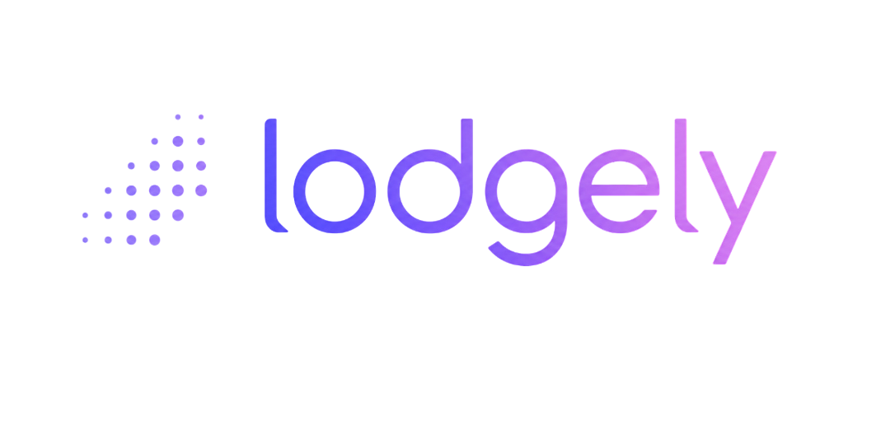

<p align="center">
  
</p>

<p align="center">
  <a href="LICENSE"></a>
  
  
  
  
  <a href="https://github.com/vidual-labs/lodgely/stargazers"></a>
</p>

# lodgely

**lodgely** is a lightweight, open-source **lead intake hub** for small teams.
It collects leads from CSV files, email (mock and real IMAP), webhook, Google Sheets fetch,
Meta Lead Ads (API), OpenFlow forms, and manual entry, normalizes them into a single schema, and gives reviewers a
clean inbox to prioritize, deduplicate and forward.

> lodgely is intentionally **not** a CRM. No deals, no pipelines, no
> sequences, no forecasts. It is the layer *before* a CRM — the place where
> incoming leads from many sources stop being scattered and start being
> actionable.

---

## Table of Contents

- [Who it is for](#who-it-is-for)
- [Features](#features)
- [What's intentionally out of scope](#whats-intentionally-out-of-scope-for-now)
- [Tech stack](#tech-stack)
- [Quick start (Docker)](#quick-start-docker)
- [Quick start (local PHP, no Docker)](#quick-start-local-php-no-docker)
- [CSV import](#csv-import)
- [Architecture at a glance](#architecture-at-a-glance)
- [Privacy & GDPR notes for self-hosters](#privacy--gdpr-notes-for-self-hosters)
- [Configuration reference](#configuration-reference)
- [Roadmap](#roadmap)
- [Ethical use](#ethical-use)
- [License](#license)

Deeper detail lives in [`docs/`](docs/): [Features](docs/FEATURES.md) ·
[Architecture](docs/ARCHITECTURE.md) · [Configuration reference](docs/CONFIGURATION.md) ·
[Privacy & GDPR](docs/PRIVACY.md) · [Roadmap](docs/ROADMAP.md) ·
[Changelog](CHANGELOG.md).

---

## Who it is for

- **Small businesses** that want to handle their own lead intake without a
  €100/seat CRM.
- **Agencies** that handle leads for several client brands. One lodgely
  install hosts many `client_name`s; scoped logins let each client see only
  their own leads.
- **Inhouse marketing teams** that just need a sane shared inbox for the
  leads coming out of forms, lists and inboxes.

If you need a full sales pipeline, lodgely is the wrong tool. If you need a
clean place to *triage* leads before anything else happens, you are at home.

---

## Features

The full write-up for every bullet below — including config flags, edge
cases and gotchas — lives in **[docs/FEATURES.md](docs/FEATURES.md)**.

**Inbox & review**

- 📥 Unified lead inbox — filters, saved views, column picker, sortable columns, pagination.
- 🧹 Automatic duplicate detection on normalized email/phone.
- 📝 Side-panel review — status, priority, notes, audit trail, Meta ad attribution.
- ✅ Outreach state (Qualified / Called / Mailed) toggles with audit trail.
- ☑️ Bulk actions — status/priority change or delete across selected leads.
- ⬇️ CSV / NDJSON export of the filtered inbox, streamed and audited.
- 🔖 Saved filters & a starred default view per user.
- 🧱 Per-user column picker, including auto-discovered custom-answer columns.

**Lead intake**

- 📂 CSV importer (10k rows/file, common header aliases recognized).
- ✉️ Email importer — mock generator, or a real IMAP backend on a schedule.
- 🔗 Signed-token webhook importer for any HTTP client.
- ✍️ Manual entry for phone calls and walk-ins.
- 📊 Google Sheets recurring lead source with auto column-mapping and idempotent re-fetches.
- 📥 Meta Lead Ads (API) recurring lead source, idempotent on the Meta lead id.
- 🌊 OpenFlow recurring lead source — add as many OpenFlow sources as you need
  (any mix of forms and self-hosted installs), each pulling submissions into a
  specific client with its own operator-defined field mapping. Idempotent on
  the submission id, scoped per source so two sources can never dedupe against
  each other's leads. Authenticates with a read-only OpenFlow API token
  (recommended) or an email/password login.

**Users & access**

- 👥 In-app user management, client-name scoping, self-service password reset links. Deactivation and password changes invalidate existing sessions immediately.
- 🔐 Two roles: `operator` (sees everything) and `client` (scoped to their `client_name`).
- 👤 Per-user profile page (name, email, password, language, theme).
- 🔑 Public password-recovery flow, enumeration-safe.

**Reporting & AI**

- 📈 Operator `/reporting` dashboard — KPI cards, trend charts, campaign breakdown, ad-spend ingestion from Meta + Google Ads (live or mock adapters). A per-client pill filter (`All clients / Client A / …`) narrows the whole dashboard to one client — lead figures by `client_name`, ad spend by that client's campaigns.
- 🔌 Multiple Meta/Google Ads connectors — beyond the single default connector, `/settings/ad-platforms` lets an operator add a dedicated Meta and/or Google Ads connector per client (its own ad account, token/OAuth). That client's ad spend and creative rows are then reported to them alone on `/my-reports` and scheduled report emails, instead of the shared default connector's data. A connector can also be scoped to one brand within an ad account that serves several businesses — by Google Business Name asset id or Meta Page id, never the customer-facing name. Each client connector must carry its own ad account id / customer id — unlike the shared default connector, it does not inherit those from `.env`, so a half-configured connector cannot quietly re-import the default account's spend under a client's name.
- 🎨 Creative performance overview on `/reporting` — top ads and age/gender segments from Meta, top keywords and ads from Google Ads, ranked by spend with clicks, leads and CPL per row. Fetched alongside the campaign metrics (same daily pull and "Fetch data now" button), aggregate numbers only.
- 📊 Custom client reporting views, assignable per client, with a Live/Hidden toggle and a `/my-reports` client tab.
- 🤖 AI summaries & lead qualification *(optional, off by default)* — OpenAI-compatible or Ollama, operator-reviewed drafts.
- 📨 Scheduled/one-off client report emails, mobile-responsive HTML.
- ✉️ In-app SMTP configuration that overrides `.env` mail settings at runtime.

**Ops**

- 🧾 Full audit log of lead lifecycle changes.
- 🗑️ Retention-aware (`retention_until`) with an opt-in GDPR purge command.
- 💾 Backup & recovery — one-click `.zip` backups, UI restore, and matching artisan commands.
- 🌙 Dark/Light mode, persisted per user.
- 🌍 i18n — English and German, persisted per user.
- 🧪 One-click demo data load/unload for a scoped, reversible demo dataset.

---

## What's intentionally out of scope (for now)

Architecture seams are reserved but not yet implemented — see [docs/ROADMAP.md](docs/ROADMAP.md):

- Multi-tenancy (`tenant_id` exists everywhere; only the default tenant is wired)

---

## Tech stack

- PHP 8.4, Laravel 12
- Livewire 3 + Alpine.js, Blade-first server rendering
- Tailwind CSS 4
- PostgreSQL 16
- Caddy 2 (reverse proxy)
- Database-driver queues (no Redis required)
- Docker Compose for local + small-VPS deployments
- Google Sheets v4 REST API + OAuth 2.0 (optional; for the Sheets import source)

A typical lodgely install runs comfortably on ~512 MB RAM.

---

## Quick start (Docker)

```bash
# 1. Clone and configure
git clone https://github.com/vidual-labs/lodgely.git
cd lodgely
cp .env.example .env
```

Open `.env` and set at minimum:

| Key | What to set |
|-----|-------------|
| `APP_URL` | Your public URL, e.g. `https://lodgely.example.com` |
| `DB_PASSWORD` | A strong password (must match across all `DB_*` vars) |
| `LODGELY_HTTP_PORT` | Host port for HTTP (default `8080`); change if that port is taken |
| `SESSION_SECURE_COOKIE` | `true` if serving over HTTPS, `false` for plain HTTP |
| `SESSION_DRIVER` | `file` is simplest; `database` works but requires the DB to be up first |

> **Set `DB_PASSWORD` before the very first `docker compose up`.** PostgreSQL
> initialises its data volume on first boot using the credentials present at
> that moment. If you change `DB_PASSWORD` in `.env` after the volume already
> exists, the old password stays baked in and the app will get
> `password authentication failed`. Fix: `docker compose down -v && docker compose up -d --build`
> (the `-v` flag removes the stale volume — only safe when you have no data to keep).

```bash
# 2. Build and start
docker compose up -d --build
# Brings up postgres, the php-fpm app, a queue worker, the scheduler
# (which runs the recurring imports — Google Sheets, IMAP, ad metrics,
# report emails, GDPR purge) and caddy.

# 3. Fix storage permissions (required on first start)
docker compose exec app chown -R www-data:www-data storage bootstrap/cache

# 4. First-time bootstrap
docker compose exec app composer install
docker compose exec app php artisan key:generate
docker compose exec app php artisan migrate --seed
docker compose exec app npm ci
docker compose exec app npm run build
```

Then open your `APP_URL` and sign in with one of the seeded accounts:

| Role     | Email                        | Password   | Sees                              |
|----------|------------------------------|------------|-----------------------------------|
| operator | `operator@example.com`       | `password` | everything                        |
| client   | `client.northwind@example.com` | `password` | leads with `client_name = Northwind Studio` |
| client   | `client.acme@example.com`    | `password` | leads with `client_name = Acme Wellness`    |

> 🔒 **Change these before going live.** The seeded accounts exist so
> you can take lodgely for a spin — they should be removed or rotated
> on any real deployment.

To create a fresh user:

```bash
docker compose exec app php artisan lodgely:user:create \
  --name="Jane Doe" --email=jane@example.com --role=operator
# or, scoped client:
docker compose exec app php artisan lodgely:user:create \
  --name="Brand Owner" --email=owner@example.com --role=client \
  --client="Northwind Studio"
```

### Behind a reverse proxy or Cloudflare

If lodgely sits behind Cloudflare, nginx, or any other reverse proxy:

- Set `APP_URL` to the **public** HTTPS URL (e.g. `https://lodgely.example.com`), not the internal address.
- Set `SESSION_SECURE_COOKIE=true` (the browser is on HTTPS even if the internal hop is HTTP).
- Set `SESSION_DRIVER=file` or ensure `SESSION_DRIVER=database` is working before testing login.
- The app already calls `trustProxies(at: '*')` in `bootstrap/app.php`, so `X-Forwarded-Proto` and other forwarded headers are trusted automatically — no extra config needed.

---

## Quick start (local PHP, no Docker)

```bash
composer install
cp .env.example .env
php artisan key:generate

# Point .env at a local Postgres 16 instance
# DB_HOST=127.0.0.1, DB_DATABASE=lodgely, ...

php artisan migrate --seed
npm ci
npm run build
php artisan serve
```

Run the queue worker in a second terminal:

```bash
php artisan queue:work
```

And the scheduler in a third — without it none of the recurring jobs
(Google Sheets fetch, Meta Lead Ads fetch, OpenFlow fetch, IMAP pull,
ad-metrics import, report emails, GDPR purge) ever run:

```bash
php artisan schedule:work
# or add to crontab: * * * * * cd /path/to/lodgely && php artisan schedule:run
```

---

## CSV import

Upload any UTF-8 CSV with a header row from **Imports → CSV import**. lodgely
recognizes the following column aliases (case-insensitive):

| Logical field | Accepted column names                                |
|---------------|------------------------------------------------------|
| `full_name`   | `name`, `full_name`, `contact`, `contact name`       |
| `email`       | `email`, `email address`, `e-mail`, `mail`           |
| `phone`       | `phone`, `phone number`, `tel`, `telephone`, `mobile`|
| `message`     | `message`, `note`, `comment`, `enquiry`, `inquiry`   |
| `client_name` | `client`, `client_name`, `brand`, `account`          |
| `campaign_name` | `campaign`, `campaign name`, `source campaign`     |

A working sample lives at `database/samples/leads-sample.csv`.

---

## Architecture at a glance

A **modular monolith**: server-rendered Blade + Livewire, no SPA. Domain
code lives under `app/Domain/` (`Leads/`, `Reporting/`, `Ai/`, `Demo/`),
adapters for both lead sources and ad-metrics sources live under
`app/Importers/`, and UI lives in `app/Livewire/`.

Adding a new lead source means:

1. Drop a class under `app/Importers/<Name>/` implementing `LeadSource`.
2. Register it in `AppServiceProvider::IMPORTERS`.
3. (Optionally) add a Livewire page to expose it in the UI.

No changes to migrations, models or the inbox are needed.

The full directory tree, the AI summary generation/review flow, and the
Meta Lead Ads field mapping are documented in
**[docs/ARCHITECTURE.md](docs/ARCHITECTURE.md)**.

---

## Privacy & GDPR notes for self-hosters

lodgely is built with privacy-by-design defaults, but **you, the operator,
are the data controller** for everything you put in it. The product gives
you the tools; the policies are yours: data minimization (only schema
fields are stored, raw payloads kept only for audit), per-lead
`retention_until` with an opt-in purge command, soft deletes, an audit
trail (`lead_events`), strict client-scoped access, and no telemetry or
external calls out of the box.

Full detail, including what lodgely deliberately does **not** do yet
(consent capture, DSAR export, automatic erasure), is in
**[docs/PRIVACY.md](docs/PRIVACY.md)**.

---

## Configuration reference

The handful of variables you're most likely to touch on a first install:

| Variable | Purpose | Default |
|----------|---------|---------|
| `APP_URL` | Public URL of the install | `http://localhost:8080` |
| `LODGELY_DEFAULT_RETENTION_DAYS` | Default lead retention, empty = retain | `365` |
| `LODGELY_EMAIL_IMPORT_DRIVER` | `mock` or `imap` | `mock` |
| `LODGELY_AI_ENABLED` | Master kill-switch for the AI module | `false` |
| `MAIL_MAILER` | Outbound mail transport (`log`, `smtp`) — prefer Settings → Email instead | `log` |
| `DB_*` | Postgres credentials | see `.env.example` |

Every other variable — IMAP, Meta/Google Ads, Google Sheets OAuth, AI
provider tuning, SMTP — has an in-app Settings page and an env-var
fallback. The full reference (40+ variables) is in
**[docs/CONFIGURATION.md](docs/CONFIGURATION.md)**.

---

## Roadmap

1. **Stronger compliance tooling** — lawful-basis tagging, DSAR export,
   one-click subject erasure.
2. **Multi-tenancy** — `tenant_id` exists everywhere; wire the full
   tenant-resolution stack so a single install can host many isolated
   workspaces.

The history of everything already shipped (reporting, AI, Meta Lead Ads,
Google Sheets, i18n, dark mode, …) is in
**[docs/ROADMAP.md](docs/ROADMAP.md)**; line-by-line changes are in
[CHANGELOG.md](CHANGELOG.md).

---

## Ethical use

lodgely is a marketing tool. We ask, as a non-binding ethical request,
that you do **not** use lodgely to run lead intake for clients in:

- **Weapons and armaments**
- **Fossil-fuel energy** (extraction, refining, distribution, generation)
- **Internal-combustion / fossil-fuel passenger vehicles** — electric
  vehicles, bicycles and public transit are explicitly fine.

This is a request from the maintainers, not a legal restriction (lodgely
remains GPL-3.0). See the preamble in `LICENSE` for the full statement.

---

## License

GPL-3.0 — see `LICENSE`.
